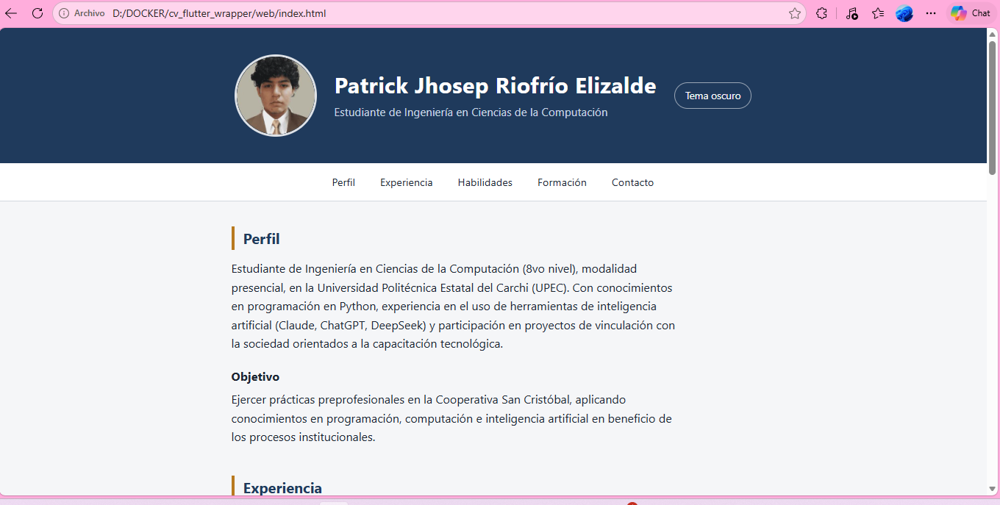
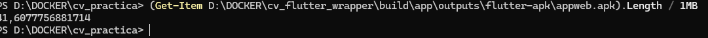

# Hoja de vida web embebida en Flutter

**Autor:** Patrick Jhosep Riofrío Elizalde · UPEC · Ingeniería en Ciencias de la Computación

Práctica: evolucionar la hoja de vida nativa a una versión web responsiva (Fase 1) e integrarla en una app Flutter mediante WebView (Fase 2).

## Estructura del repositorio

```
web/                     Fase 1: HTML5, CSS3 y JavaScript
cv_flutter_wrapper/      Fase 2: proyecto Flutter (contenedor híbrido)
  lib/main.dart
  pubspec.yaml
  assets/web/            copia de la carpeta web/ (Opción A: carga local)
README.md                Informe
```

## Fase 1. Web CV

- **HTML semántico:** `header`, `nav`, `main`, `section`, `article`, `footer`.
- **Secciones:** perfil y objetivo, experiencia, habilidades, formación y certificaciones, contacto.
- **Mobile-First:** el CSS base es para móvil; un solo `@media (min-width: 768px)` adapta pantallas amplias. Se usa Flexbox y `rem`.
- **Tema claro/oscuro** con variables CSS.
- **Interactividad con JavaScript:**
  - Acordeón en la experiencia.
  - Filtro de habilidades por categoría.
  - Validación del formulario de contacto (nombre, correo y mensaje).
  - Botón de tema.

Para probarla en el navegador, abre `web/index.html`.

## Fase 2. App Flutter (`cv_flutter_wrapper`)

- **Paquetes:** `webview_flutter` (WebView) y `url_launcher` (abrir `tel:` y `mailto:` fuera del WebView).
- **Opción A (offline):** la web está en `assets/web/` y se carga con `loadFlutterAsset('assets/web/index.html')`. Se declara en `pubspec.yaml` con `assets: - assets/web/`.
- **Controles nativos (AppBar):** recargar, cambiar tema claro/oscuro y copiar datos de contacto.
- **Comunicación nativo ↔ web:**
  - Flutter → web: `runJavaScript("setTheme('dark')")`.
  - Web → Flutter: canal `FlutterTema`, que avisa cuando el usuario cambia el tema desde la página.
- **Estados:** barra de progreso mientras carga y pantalla de error con botón *Reintentar*.

### Cómo compilar (Docker, imagen `instrumentisto/flutter:3.41.6`)

```powershell
cd D:\DOCKER
docker run --rm -v ${PWD}:/app -w /app instrumentisto/flutter:3.41.6 flutter create cv_flutter_wrapper
# Copiar lib/main.dart, pubspec.yaml y assets/web/ de este repositorio sobre el proyecto creado
docker run --rm -v ${PWD}/cv_flutter_wrapper:/app -v gradle_cache:/root/.gradle -w /app instrumentisto/flutter:3.41.6 flutter build apk --release
adb install -r cv_flutter_wrapper\build\app\outputs\flutter-apk\app-release.apk
```
## Capturas de pantalla

**Web en el navegador**



**App Flutter en tema claro**


**App Flutter en tema oscuro**


**Compilacion**



## Cuadro comparativo: nativo Android vs. web embebida en Flutter

| Aspecto | Nativo Android (práctica anterior) | Web embebida (Flutter + WebView) |
|---|---|---|
| Tecnología | Kotlin/Java y XML en Android Studio | HTML, CSS y JS dentro de un WebView en Flutter |
| Base de código | Solo Android | La web sirve también en navegador, iOS y Android |
| Experiencia de usuario | Componentes y gestos propios del sistema, animaciones fluidas | Apariencia propia de la web; cercana a la nativa si el diseño es cuidado |
| Rendimiento | Mayor; dibuja directo con el sistema | Menor: carga el motor del WebView y renderiza HTML/CSS/JS |
| Tamaño de la app | Menor | Mayor (Flutter + WebView + assets) |
| Actualizaciones | Recompilar y reinstalar | Opción A: recompilar. Opción B (remota): basta actualizar el servidor |
| Acceso al dispositivo | Directo a todas las APIs | Solo mediante canales entre JS y Flutter |
| Mantenibilidad | Un código por plataforma | Un solo código web reutilizable |
| Funcionamiento sin internet | Sí | Sí con la Opción A (assets locales) |

### Métricas medidas (completar con tus datos)

| Métrica | Nativa | Web embebida |
|---|---|---|
| Tamaño del APK (MB) | | |
| Tiempo de compilación (min) | | |
| Tiempo hasta ver la primera pantalla (s) | | |

Tamaño del APK: `dir cv_flutter_wrapper\build\app\outputs\flutter-apk\app-release.apk`

## Conclusiones

1. **Experiencia de usuario:** el enfoque embebido permite una interfaz moderna y adaptable con HTML y CSS, y los controles nativos de Flutter (AppBar, tema, recarga) la integran en la app. Aun así, la versión nativa responde de forma más natural en gestos, transiciones y comportamiento del sistema.
2. **Rendimiento:** el WebView añade una capa extra (motor web más el contenedor Flutter), así que la app pesa más y arranca más lento que una app nativa pura. Para una hoja de vida, con contenido estático e interacciones ligeras, la diferencia casi no se percibe.
3. **Mantenibilidad:** una sola base de código web se reutiliza en navegador, Android e iOS, y cualquier cambio de contenido se hace en un solo lugar. La versión nativa exige mantener el código por plataforma, pero ofrece más control y acceso directo al dispositivo.
4. **Arquitectura híbrida:** la comunicación en ambos sentidos (`runJavaScript` y `JavaScriptChannel`) permite que la parte web y la nativa trabajen coordinadas, como en la sincronización del tema.
5. **Cumplimiento de los objetivos:** se rediseñó la hoja de vida en tecnologías web estándar con enfoque Mobile-First, se integró como contenedor híbrido en Flutter y se comparó con el desarrollo nativo.
